# Summarizarr

[](https://github.com/enddzone/summarizarr/actions/workflows/ci.yml)
[](https://github.com/enddzone/summarizarr/actions/workflows/release.yml)
[](https://opensource.org/licenses/MIT)
[](https://github.com/enddzone/summarizarr/pkgs/container/summarizarr)

AI-powered Signal message summarizer in a single ~57MB container. Connects to Signal groups, stores messages in SQLite, and generates periodic AI summaries using local (Ollama sidecar) or cloud AI providers (OpenAI, Groq, Gemini, Claude).

## Features

- **🐳 Single Container**: All-in-one deployment with embedded web UI
- **🤖 Multi-Provider AI**: Local Ollama sidecar, OpenAI, Groq, Gemini, Claude support
- **🔒 Privacy-First**: Automatic data anonymization before AI processing
- **📱 Signal Integration**: WebSocket connection to signal-cli-rest-api
- **🌐 Modern UI**: Responsive Next.js interface with filtering and export
- **⚡ Production Ready**: Health checks, multi-arch builds, security scanning

## Architecture

```mermaid
graph TB
    subgraph "Signal Integration"
        SC[Signal CLI REST API<br/>Port 8080]
    end
    
    subgraph "Summarizarr Container"
        subgraph "Backend (Go)"
            WS[WebSocket Client]
            API[HTTP Server<br/>Port 8081]
            DB[(SQLite Database)]
            SCHED[AI Scheduler]
        end
        
        subgraph "Frontend"
            UI[Embedded Next.js UI]
        end
    end
    
    subgraph "AI Providers"
        LOCAL[🏠 Ollama<br/>Sidecar AI]
        OPENAI[🌐 OpenAI<br/>GPT-4]
        GROQ[⚡ Groq<br/>Fast Inference]
        GEMINI[🧠 Gemini<br/>via Proxy]
        CLAUDE[🤖 Claude<br/>via Proxy]
    end
    
    SC -.->|WebSocket| WS
    WS --> DB
    SCHED --> DB
    API --> DB
    API --> UI
    SCHED --> LOCAL
    SCHED --> OPENAI
    SCHED --> GROQ
    SCHED --> GEMINI
    SCHED --> CLAUDE
    
    style LOCAL fill:#e1f5fe
    style OPENAI fill:#fff3e0
    style GROQ fill:#f3e5f5
    style GEMINI fill:#e8f5e8
    style CLAUDE fill:#fce4ec
```



## Quick Start

### Docker Compose (Recommended)

```bash
# 1. Download configuration
curl -O https://raw.githubusercontent.com/enddzone/summarizarr/main/compose.yaml
curl -O https://raw.githubusercontent.com/enddzone/summarizarr/main/.env.example
cp .env.example .env

# 2. Configure Signal phone number
# Edit the .env file and set your Signal phone number:
# SIGNAL_PHONE_NUMBER=+1234567890

# 3. Configure AI
# Edit the .env file and update your OpenAI api key:
# OPENAI_API_KEY=sk-my-api-key

# 4. Start services
docker compose up -d

# 5. Access web UI: http://localhost:8081
```

### Single Container

```bash
docker run -d \
  --name summarizarr \
  -p 8081:8081 \
  -e SIGNAL_PHONE_NUMBER="+1234567890" \
  -e AI_PROVIDER=openai \
  -e OPENAI_API_KEY=sk-openai-api-key \
  -v summarizarr-data:/data \
  ghcr.io/enddzone/summarizarr:latest
```

## AI Provider Setup

### Local AI (Ollama Sidecar)
```bash
# 1. Start Ollama + pull model
docker run -d -p 11434:11434 --name ollama ollama/ollama
docker exec ollama ollama pull llama3.2:1b

# 2. Configure Summarizarr
AI_PROVIDER=local
OLLAMA_HOST=http://localhost:11434

# 3. With Docker Compose (recommended)
COMPOSE_PROFILES=local-ai docker compose up -d
```

### Cloud Providers
```bash
# OpenAI
AI_PROVIDER=openai
OPENAI_API_KEY=sk-your-key-here

# Groq (fastest inference)
AI_PROVIDER=groq
GROQ_API_KEY=gsk-your-key-here

# Gemini (requires proxy)
AI_PROVIDER=gemini
GEMINI_API_KEY=your-key-here
GEMINI_BASE_URL=http://localhost:8000/hf/v1

# Claude (requires proxy)  
AI_PROVIDER=claude
CLAUDE_API_KEY=sk-ant-your-key-here
CLAUDE_BASE_URL=http://localhost:8000/openai/v1
```

## Configuration

| Variable | Default | Description |
|----------|---------|-------------|
| `SIGNAL_PHONE_NUMBER` | - | **Required** Phone number for Signal |
| `AI_PROVIDER` | `openai` | AI provider: `local`, `openai`, `groq`, `gemini`, `claude` |
| `SUMMARIZATION_INTERVAL` | `12h` | Summary frequency (30m, 1h, 6h, 1d) |
| `DATABASE_PATH` | `/app/data/summarizarr.db` | SQLite database location |
| `LOG_LEVEL` | `INFO` | Logging verbosity |

See [full configuration reference](https://github.com/enddzone/summarizarr/blob/main/.env.example) for all provider-specific options.

## Development

```bash
# Quick development setup
make dev-setup
make all          # Start Signal + Go backend + Next.js frontend

# Service URLs
# Frontend (dev): http://localhost:3000 - Hot reload
# Backend API:    http://localhost:8081 - Embedded frontend  
# Signal CLI:     http://localhost:8080 - WebSocket service

# Individual services
make signal       # Signal container only
make backend      # Go backend
make frontend     # Next.js with hot reload

# Testing
make test-backend
make test-frontend

# Stop all
make stop
```

## API Endpoints

| Method | Endpoint | Description |
|--------|----------|-------------|
| `GET` | `/` | Web interface |
| `GET` | `/health` | Health check |
| `GET` | `/api/version` | Version info |
| `GET` | `/api/summaries` | List summaries (with filters) |
| `GET` | `/api/groups` | List Signal groups |
| `GET` | `/api/export` | Export data (JSON/CSV) |
| `DELETE` | `/api/summaries/{id}` | Delete summary |

## Privacy & Security

- **Automatic anonymization** of names and phone numbers before AI processing
- **Local data storage** in SQLite database
- **Database encryption** with SQLCipher (AES-256)
- **Non-root container** execution
- **Vulnerability scanning** with Trivy
- **No external data** sent without anonymization

### Database Encryption

Optional SQLCipher encryption for enhanced data security:

```bash
# Generate encryption key (64-char hex)
openssl rand -hex 32

# Development (environment variable)
SQLCIPHER_ENCRYPTION_ENABLED=true
SQLCIPHER_ENCRYPTION_KEY=your_64_character_hex_key

# Production (Docker secrets)
SQLCIPHER_ENCRYPTION_ENABLED=true
SQLCIPHER_ENCRYPTION_KEY_FILE=/run/secrets/db_key
```

**Key Management**:
- Store keys in Docker secrets or secure key management system
- Keys are 32-byte (64 hex characters) for AES-256 encryption
- Never commit keys to version control

**Migration**: Convert existing databases:
```bash
# Build migration tool
CGO_ENABLED=1 go build -tags="sqlite_crypt" cmd/migrate-to-sqlcipher/main.go

# Migrate database
./migrate-to-sqlcipher -sqlite old.db -sqlcipher encrypted.db -key "your_key"
```

**Key Rotation**: For future key rotation (currently manual process):
1. Stop the application
2. Create new encrypted database with new key
3. Migrate data from old to new database using migration tool
4. Update key configuration and restart with new database

## Production Deployment

### Container Registry
```bash
# Latest version
docker pull ghcr.io/enddzone/summarizarr:latest

# Specific version
docker pull ghcr.io/enddzone/summarizarr:v1.0.0
```

### Health Monitoring
```bash
# Health check
curl http://localhost:8081/health

# Version info
curl http://localhost:8081/api/version

# Container logs
docker logs summarizarr
```

## Contributing

1. Fork the repository
2. Create feature branch: `git checkout -b feature/name`
3. Commit changes: `git commit -m 'Add feature'`
4. Push branch: `git push origin feature/name`
5. Open Pull Request

## License

MIT License - see [LICENSE](LICENSE) file for details.

## Acknowledgments

- [Signal CLI REST API](https://github.com/bbernhard/signal-cli-rest-api) - Signal integration
- [Ollama](https://ollama.ai/) - Local AI capabilities
- [Next.js](https://nextjs.org/) - Modern web framework
- [Shadcn/ui](https://ui.shadcn.com/) - UI components